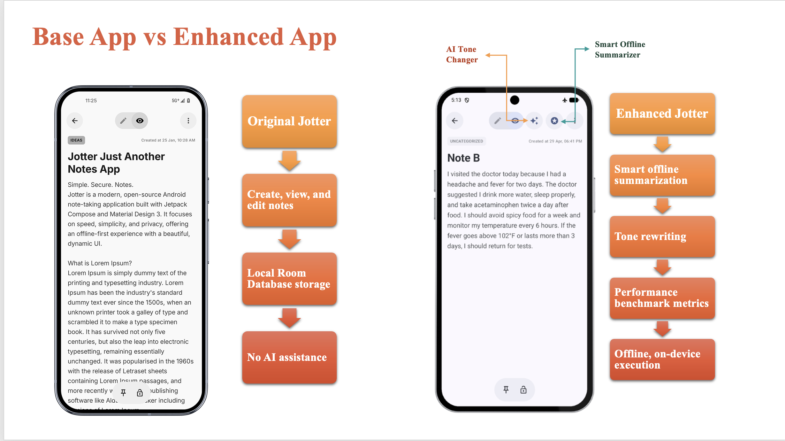
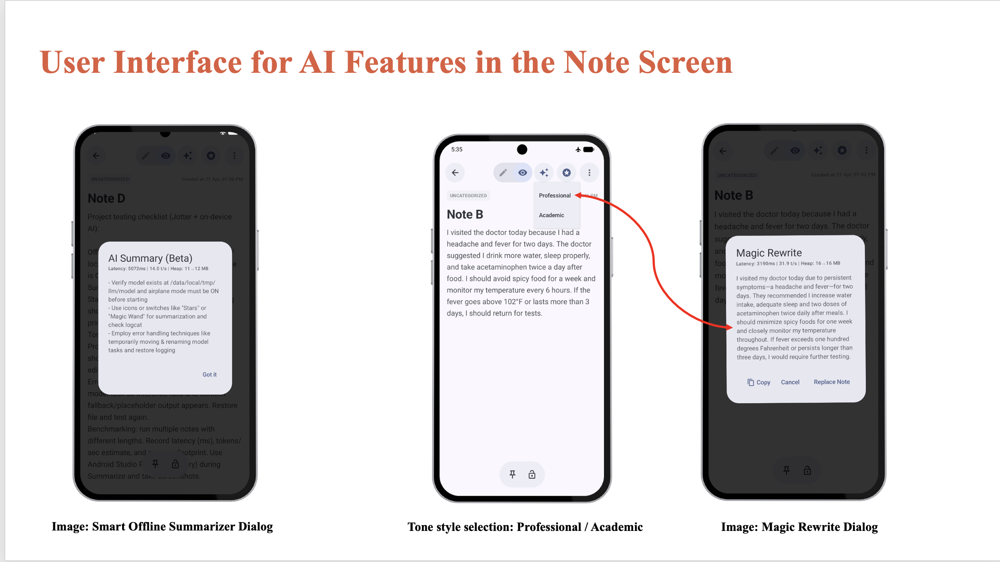
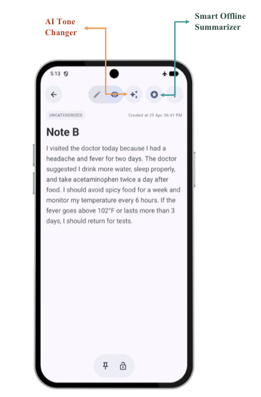
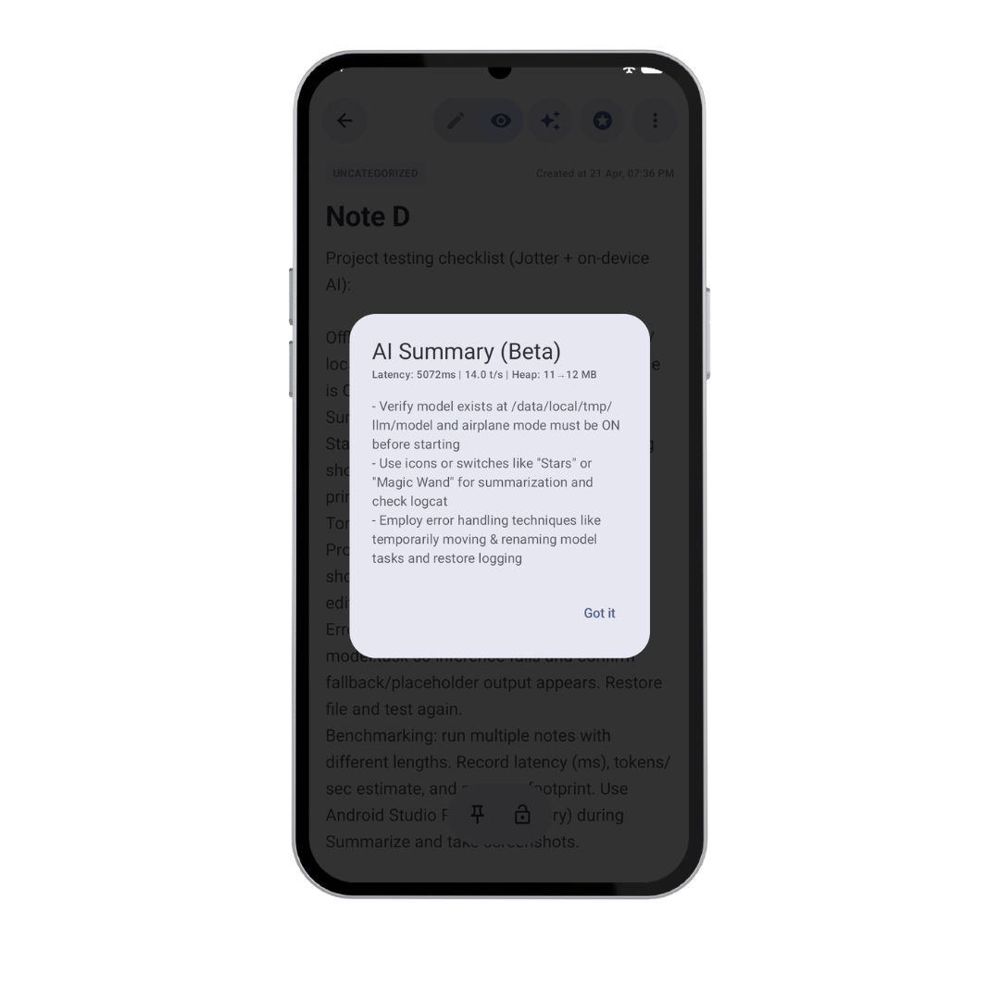
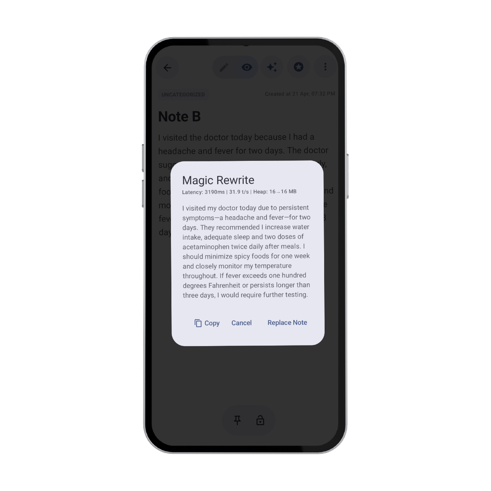
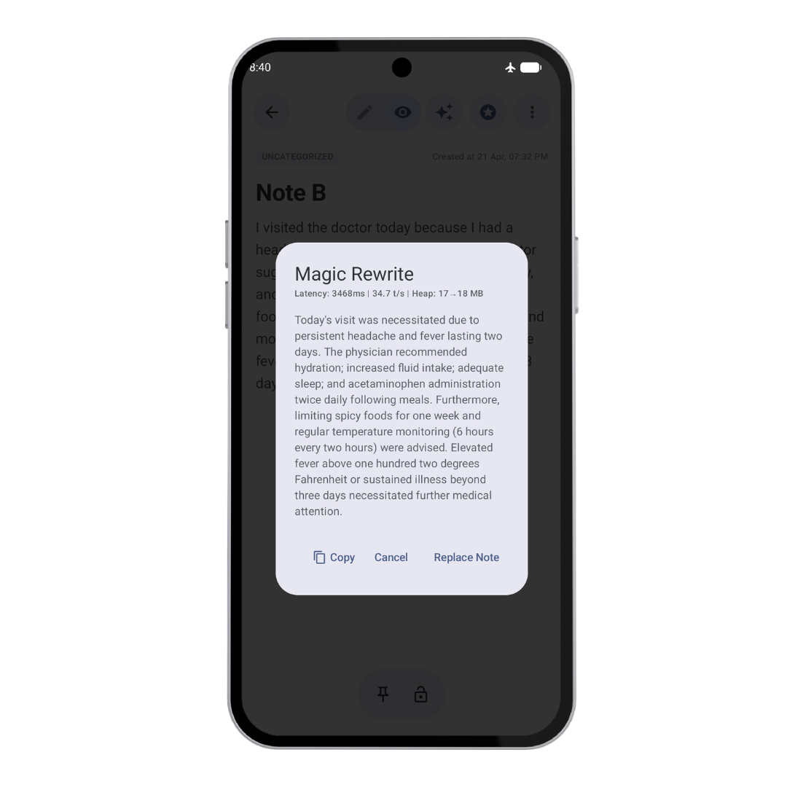
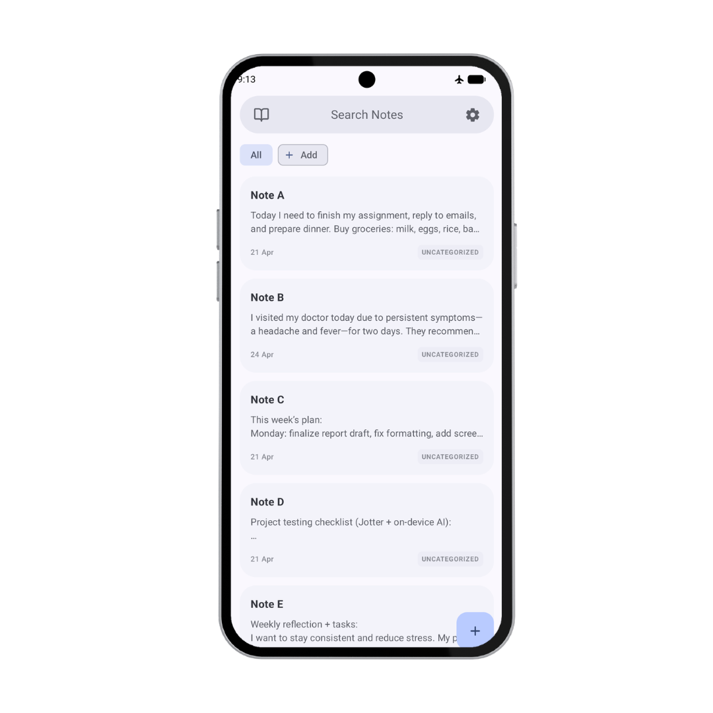
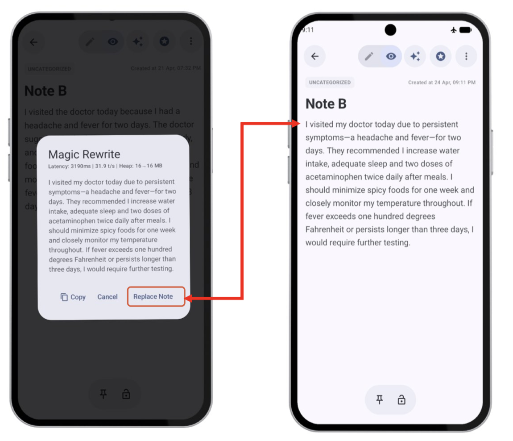

# Privacy-First Intelligent Note Management Using On-Device Generative AI

An Android and mobile AI project that enhances the open-source **Jotter** note-taking application with privacy-first, on-device generative AI capabilities.

I designed and implemented the AI feature layer, including offline note summarization, professional and academic tone rewriting, local Gemma inference, user-controlled note persistence, offline verification, and runtime performance measurement.

**Repository:** https://github.com/mishrasweta088/Jotter

---

## Project Scope

This project extends the open-source Jotter Android application with on-device generative AI functionality.

My implementation includes:

- Smart Offline Summarizer
- Professional and Academic Tone Changer
- MediaPipe LLM Inference integration
- Local Gemma 3 1B Q4 model execution
- ViewModel and Hilt-based AI state management
- AI result dialogs and user interaction flows
- User-controlled note replacement and persistence
- Offline execution verification
- Latency, approximate throughput, and heap-memory measurement

---

## 1. Project Overview

The project explores how generative AI can be integrated into an Android note-taking application while keeping AI processing on the device.

The application uses the **MediaPipe LLM Inference API** with a locally stored **Gemma 3 1B Q4 model** to provide:

- Offline note summarization
- Professional tone rewriting
- Academic tone rewriting
- Runtime performance metrics

The implemented AI features do not require note content to be sent to an external cloud AI service.

---

## 2. Problem Statement

Many AI-powered productivity applications rely on cloud APIs for summarization and rewriting.

This can introduce:

- Internet dependency
- External processing of note content
- Network latency
- External service availability concerns
- API usage costs

This project investigates a local alternative by running a compact language model directly on the Android device.

The goal was to support useful AI-assisted note processing while maintaining offline availability and keeping the implemented AI workflow local.

---

## 3. Key Features

### Smart Offline Summarizer

- Generates concise bullet-point summaries
- Runs directly on the Android device
- Leaves the original note unchanged
- Displays runtime metrics with the generated result

### AI Tone Changer

- Supports professional rewriting
- Supports academic rewriting
- Attempts to preserve the original meaning
- Allows users to copy, cancel, or apply the result

### User-Controlled Persistence

- Generated rewrites are not saved automatically
- The user reviews the output first
- The note changes only after selecting **Replace Note**
- Updated content is persisted after the user saves the note

### Offline Execution

- AI features were tested with airplane mode enabled
- Logcat confirmed use of a local model path
- No external cloud AI API was used for summarization or rewriting

### Performance Measurement

- Measures inference latency
- Estimates approximate tokens per second
- Records approximate heap usage
- Uses Android Studio Logcat and Profiler for observation

---

## 4. Screenshots

### Base Application vs. Enhanced Application

This project adds on-device AI summarization, tone rewriting, runtime metrics, and user-controlled persistence to the existing Jotter note-taking workflow.

<p align="center">
  
</p>

### AI Feature Workflow

The enhanced note screen provides access to the Smart Offline Summarizer and AI Tone Changer.

<p align="center">
  
</p>

### Added AI Actions

<p align="center">
  
</p>

### Smart Offline Summarizer

<p align="center">
  
</p>

### Tone-Based Rewriting

| Professional Rewrite | Academic Rewrite |
|---|---|
|  |  |

### Offline Testing

<p align="center">
  
</p>

### User-Controlled Persistence

The generated rewrite is persisted only after the user selects **Replace Note** and saves the updated note.

<p align="center">
  
</p>

---

## Demo Videos

### Smart Offline Summarizer

[Watch the summarizer demo](docs/demo/summarizer-demo.mp4)

### AI Tone Changer

[Watch the tone rewrite demo](docs/demo/tone-rewrite-demo.mp4)

---

## Project Presentation

[View the project presentation](docs/presentation/project-presentation.pptx)

---

## 5. System Architecture

```text
┌───────────────────────────────────────┐
│        Jetpack Compose UI             │
│                                       │
│  Note Screen, Menus, Result Dialogs   │
└──────────────────┬────────────────────┘
                   │
                   ▼
┌───────────────────────────────────────┐
│         Android ViewModel             │
│                                       │
│ UI State, AI Requests, Result State   │
│ Dependency Access through Hilt        │
└──────────────┬───────────────┬────────┘
               │               │
               ▼               ▼
┌──────────────────────┐  ┌──────────────────────┐
│   AI Service Layer   │  │    Room Database     │
│                      │  │                      │
│ Prompt construction  │  │ Local note storage   │
│ Inference execution  │  │ Existing save flow   │
│ Metric collection    │  │                      │
└───────────┬──────────┘  └──────────────────────┘
            │
            ▼
┌───────────────────────────────────────┐
│     MediaPipe LLM Inference API       │
└──────────────────┬────────────────────┘
                   │
                   ▼
┌───────────────────────────────────────┐
│    Local Gemma 3 1B Q4 Model File     │
└───────────────────────────────────────┘
```

### Request Flow

1. The user opens a note.
2. The user selects Summarize, Professional Rewrite, or Academic Rewrite.
3. The Compose UI sends the action and note text to the ViewModel.
4. The ViewModel calls the AI service.
5. The AI service creates a task-specific prompt.
6. MediaPipe runs the locally stored Gemma model.
7. The generated result and runtime metrics return to the ViewModel.
8. The Compose UI displays the result in a dialog.
9. Rewritten content is persisted only after user confirmation and saving.

This architecture separates UI rendering, state management, AI inference, local model execution, and note persistence.

---

## 6. Tech Stack

| Area | Technology |
|---|---|
| Programming Language | Kotlin |
| Platform | Android |
| User Interface | Jetpack Compose |
| State Management | Android ViewModel |
| Dependency Injection | Hilt |
| AI Framework | MediaPipe LLM Inference API |
| Local Model | Gemma 3 1B Q4 |
| Local Storage | Room Database |
| Debugging | Android Studio Logcat |
| Profiling | Android Studio Profiler |
| Base Application | Open-source Jotter Android application |

### Why Kotlin

Kotlin was used because it integrates directly with the Android ecosystem and Jetpack libraries.

It supports:

- Null safety
- Concise state handling
- Android lifecycle components
- Asynchronous processing
- Java interoperability
- Modern Android development patterns

### Why Jetpack Compose

Jetpack Compose supports declarative and state-driven UI development.

Generated output, loading state, dialog visibility, and benchmark values can be represented as UI state and displayed when the ViewModel updates.

### Why ViewModel and Hilt

The ViewModel coordinates:

- Current note text
- Selected AI action
- Loading state
- Generated result
- Performance metrics
- Dialog state
- Note replacement state

Hilt connects the ViewModel to the AI service through dependency injection and reduces manual object construction.

---

## 7. Smart Offline Summarizer

The Smart Offline Summarizer generates a concise representation of a note directly on the device.

```text
Note Text
   ↓
Compose Summarizer Action
   ↓
ViewModel
   ↓
AI Summarizer Service
   ↓
Summarization Prompt
   ↓
MediaPipe LLM Inference
   ↓
Local Gemma 3 1B Q4 Model
   ↓
Summary and Runtime Metrics
   ↓
AI Summary Dialog
```

The summarization prompt instructs the model to generate a short bullet-point summary.

The result is displayed separately from the editable note, ensuring that the original note remains unchanged.

---

## 8. AI Tone Changer

The AI Tone Changer rewrites note content in two styles:

- Professional
- Academic

The rewrite prompt instructs the model to change the writing style while preserving the original meaning.

```text
Original Note
   ↓
Professional or Academic Selection
   ↓
ViewModel
   ↓
Tone-Specific Prompt
   ↓
Local Gemma Inference
   ↓
Magic Rewrite Dialog
   ↓
Copy, Cancel, or Replace Note
```

### Copy

Copies the generated text without modifying the current note.

### Cancel

Closes the dialog and preserves the original note.

### Replace Note

Places the generated text into the editable note state.

The user can review the generated rewrite before applying it.

---

## 9. Local Storage and Persistence

The application uses **Room Database** for local note storage.

Room was retained because the project focused on:

- On-device AI processing
- Offline availability
- Integration with the existing note workflow
- Local persistence

### Rewrite Persistence Flow

```text
Generated Rewrite
   ↓
Displayed in Magic Rewrite Dialog
   ↓
User Selects Replace Note
   ↓
Editable Note State Is Updated
   ↓
User Saves the Note
   ↓
Updated Note Is Stored in Room Database
```

The generated rewrite is not automatically written to the database.

It becomes persistent only after the user:

1. Reviews the result
2. Selects **Replace Note**
3. Saves the updated note

This prevents AI-generated content from silently overwriting user-authored notes.

---

## 10. Privacy and Offline Execution

The project uses a locally stored model instead of a cloud-based generative AI API.

### Benefits of Local Inference

- Note content remains on the device for the implemented AI workflow
- AI features remain available without internet access
- No external AI request is required
- The application is not dependent on cloud AI service availability
- Model execution occurs locally

### Airplane-Mode Testing

The application was tested with airplane mode enabled.

During testing:

- The application remained accessible
- Saved notes could be opened
- Summarization completed successfully
- Professional rewriting completed successfully
- Academic rewriting completed successfully

### Logcat Verification

Android Studio Logcat showed the model being initialized from a local device path.

This confirmed that the MediaPipe LLM Inference API was using the local model file during execution.

---

## 11. Performance Benchmarking

The project records three runtime measurements for each AI action.

### Latency

Latency represents the total time required to generate the output.

It is reported in milliseconds.

### Approximate Throughput

Throughput is reported as approximate generated tokens per second.

The value is estimated from generated output length rather than measured using an internal model tokenizer.

### Approximate Heap Usage

Heap usage is recorded before and after the AI operation.

The values provide an approximate indication of memory behavior during inference.

Heap measurements can be affected by:

- Garbage collection
- Existing allocations
- Cached objects
- Model initialization
- Android runtime behavior
- Emulator or device activity

Android Studio Profiler was used to observe memory behavior during execution.

---

## 12. Evaluation Results

All three tests used the same **407-character input** for comparison.

| Feature | Input Length | Latency | Approximate Throughput | Approximate Heap Usage |
|---|---:|---:|---:|---:|
| Smart Offline Summarizer | 407 characters | 5072 ms | ~14.0 tokens/sec | 11 MB → 12 MB |
| Professional Rewrite | 407 characters | 3190 ms | ~31.9 tokens/sec | 16 MB → 16 MB |
| Academic Rewrite | 407 characters | 3468 ms | ~34.7 tokens/sec | 17 MB → 18 MB |

### Observations

- All three features completed successfully using local inference.
- The summarization task had the highest measured latency.
- Professional rewriting completed faster than summarization.
- Academic rewriting produced the highest approximate throughput.
- Heap changes remained small during the observed runs.

Performance can vary depending on:

- Emulator or physical device
- Available memory
- Processor capability
- Input length
- Output length
- Prompt design
- Model initialization state
- Android runtime behavior

---

## 13. Engineering Trade-offs

### Local AI vs. Cloud AI

| Local AI | Cloud AI |
|---|---|
| Processes notes locally | Usually sends data to a remote service |
| Works offline | Requires network connectivity |
| No external AI request | Depends on service availability |
| Limited by mobile hardware | Uses more powerful remote hardware |
| Requires local model storage | Model storage is managed remotely |
| Performance varies by device | Performance depends on network and provider |

Local inference was selected because offline availability and local processing were the primary goals.

The trade-off is that a compact model running on mobile hardware can introduce higher latency and lower output quality than a larger cloud-hosted model.

### Gemma 3 1B Q4 vs. a Larger Model

The Gemma 3 1B Q4 model provides a practical balance between:

- Model capability
- Storage size
- Memory usage
- Inference latency
- Mobile-device compatibility

A larger model may improve output quality but would require more storage, memory, and processing resources.

### Room Database vs. Cloud Synchronization

Room preserves the local-first storage flow and supports offline note access.

The project prioritized local processing and offline availability rather than introducing remote synchronization, authentication, and conflict-resolution logic.

### Explicit Replacement vs. Automatic Replacement

Generated rewrites are displayed for review instead of immediately replacing the original note.

This keeps the user in control of AI-generated changes.

---

## 14. Challenges and Debugging

### Integrating AI into an Existing Application

The AI features had to work with the existing:

- Compose UI
- ViewModel state
- Room persistence
- Note-editing flow
- Save behavior

The integration preserved the original note-taking workflow while adding AI actions and generated-result handling.

### Model Loading

A locally stored model requires the correct device path.

Logcat was used to verify:

- Model initialization
- Local model path
- Inference execution
- Output generation
- Runtime metrics

### Mobile Resource Constraints

On-device inference is affected by:

- Device memory
- CPU performance
- Current system load
- Input size
- Output size
- Android runtime behavior

### Prompt Design

Prompt design affects whether the model:

- Produces concise summaries
- Uses bullet points
- Preserves meaning
- Applies the requested tone
- Avoids unnecessary text

Task-specific prompts were used instead of a general-purpose chat interface.

---

## 15. Setup Requirements

General requirements:

- Android Studio
- Android SDK supported by the project
- Kotlin and Gradle support
- Android emulator or compatible physical device
- Sufficient storage for the local model
- Sufficient memory for model execution
- MediaPipe LLM Inference dependency
- Compatible Gemma 3 1B Q4 model file

Clone the repository:

```bash
git clone https://github.com/mishrasweta088/Jotter.git
cd Jotter
```

Open the project in Android Studio and allow Gradle synchronization to complete.

---

## 16. Model Setup

The application expects a locally stored Gemma 3 1B Q4 model compatible with the MediaPipe LLM Inference API.

### Setup Process

1. Obtain a compatible Gemma 3 1B Q4 model from an authorized source.
2. Review the model license and usage requirements.
3. Place the model in the location expected by the application.
4. Confirm that the configured path matches the device model path.
5. Launch the application.
6. Use Logcat to verify successful model initialization.

The project integrates an existing pretrained and quantized model for local mobile inference.

---

## 17. Running the Application

1. Clone the repository.
2. Open the project in Android Studio.
3. Complete the local model setup.
4. Select an emulator or physical Android device.
5. Build and run the application.
6. Create or open a note.
7. Select an AI action.

### Running the Summarizer

1. Open a note.
2. Select the Smart Offline Summarizer.
3. Wait for local inference to complete.
4. Review the bullet-point summary.
5. Review the displayed runtime metrics.
6. Close the dialog using **Got it**.

### Running the Tone Changer

1. Open a note.
2. Select the AI Tone Changer.
3. Choose Professional or Academic.
4. Wait for local inference to complete.
5. Review the generated rewrite.
6. Select Copy, Cancel, or Replace Note.
7. Save the note after replacement.

---

## 18. Testing the AI Features

### Offline Test

1. Confirm that the local model is configured.
2. Enable airplane mode.
3. Open an existing note.
4. Run the Smart Offline Summarizer.
5. Run Professional Rewrite.
6. Run Academic Rewrite.
7. Confirm that each feature returns output without internet access.

### Local Model Verification

1. Open Android Studio Logcat.
2. Trigger an AI action.
3. Confirm that the service initializes the local model path.
4. Confirm that inference begins and completes.

### Persistence Test

1. Open a note.
2. Generate a tone rewrite.
3. Select **Replace Note**.
4. Save the note.
5. Close and reopen the note.
6. Confirm that the rewritten content remains stored.

### Original Note Protection Test

1. Generate a summary.
2. Close the summary dialog.
3. Confirm that the original note remains unchanged.
4. Generate a rewrite.
5. Select Cancel.
6. Confirm that the original note remains unchanged.

---

## 19. Lessons Learned

### Mobile AI Requires Full-System Integration

Running a model inside an Android application requires coordination between:

- UI state
- Model initialization
- Local file access
- Inference execution
- User interaction
- Persistence
- Debugging
- Performance measurement

### Local Processing Changes the Architecture

On-device inference reduces dependency on external AI services while moving computation, storage, and performance management to the device.

### User Control Matters

AI-generated content should be reviewed before it replaces user-authored text.

The Replace Note workflow creates a clear boundary between generated output and saved content.

### Benchmark Context Matters

Performance values require context such as:

- Input size
- Device
- Model
- Runtime state
- Measurement method

For this reason, throughput and heap values are reported as approximate.

### Prompt Design Is an Engineering Decision

Prompt structure directly affects summary quality, tone consistency, output length, and preservation of meaning.

---

## 20. Engineering Considerations

- On-device inference performance depends on device hardware, available memory, input length, and Android runtime conditions.
- Generated output can vary based on prompt structure and the capabilities of the local model.
- Throughput and heap-memory values are reported as approximate measurements to reflect the benchmarking method used.
- The project prioritizes local processing and offline functionality over cloud-based synchronization.
- The implementation integrates a pretrained, quantized Gemma model for mobile inference.

---

## 21. Technical Roadmap

Potential extensions include:

- Evaluate additional mobile-compatible models and quantization configurations
- Compare cold-start and warm-start inference performance
- Benchmark across multiple physical Android devices
- Add structured benchmark export and repeated-run analysis
- Support configurable summary length and additional rewrite styles
- Improve model-loading, progress, and error-state feedback
- Add local revision history and rollback for AI-assisted edits
- Explore optional user-controlled encrypted backup

---

## 22. Credits and Acknowledgements

This project was completed at the School of Computing, Binghamton University, SUNY.

### Project Author

**Sweta Mishra**

### Academic Advisor

**Prof. Zeyu Ding**

### Base Application

Built by extending the open-source Jotter Android application developed by OpenAppsLabs.

### Technologies

- Kotlin
- Android
- Jetpack Compose
- Android ViewModel
- Hilt
- Room Database
- MediaPipe LLM Inference API
- Gemma 3 1B
- Android Studio Logcat
- Android Studio Profiler

---

## License

The original Jotter project is licensed under the GNU General Public License v3.0.

See the repository license file for details.